<div align="center">



<br>

[](https://github.com/rithinkrishnakv/jobless-router/actions/workflows/tests.yml)
[](LICENSE)
[](https://www.python.org/)
[](https://ris-live.ripe.net/)
[](#advisory-mitigation-playbook)
[](#what-it-actually-does)

</div>

A real-time BGP zero-trust threat-intelligence engine. It listens to the global
routing firehose, cryptographically validates announcements against live RPKI,
and **scores intent** — accidental misconfiguration vs. deliberate route leak
vs. targeted interception attempt — instead of just flagging "RPKI invalid"
and stopping there.

---

## What it actually does

1. **AS-path traversal** — names the exact "complicit" upstream transit
   provider that accepted a bad route from its origin and propagated it
   onward unfiltered.
2. **Intent heuristics** — two independent 0-100 scores:
   - *Fat-finger*: broad over-deaggregated prefix, RPKI `INVALID_LENGTH`.
   - *Targeted MITM*: highly specific prefix, hits a watched critical service,
     zero business relationship with the legitimate holder, breaks
     [valley-free routing](https://en.wikipedia.org/wiki/Valley-free_routing)
     (the Gao-Rexford property RFC 7908 leans on to define route leaks), or
     pairs with AS-path poisoning.
3. **BGP community decoding** — flags RFC 1997/7999 well-known communities,
   including the blackhole (RTBH) community, so a deliberate, operator-issued
   mitigation route doesn't get misclassified as a hijack.
4. **AS-path poisoning detection** — separates benign self-prepending
   (traffic engineering) from a non-origin ASN planted mid-path to dodge a
   specific network's own loop-prevention.
5. **Baseline deviation detection** — learns which origin ASNs and upstreams
   have legitimately announced each prefix before, so it can catch a leak
   even when there's no RPKI ROA to be cryptographically invalid against.
   (RPKI ROA coverage is still well under half the routed table — silence
   isn't innocence.)
6. **Blast-radius estimation** — counts how many distinct, geographically
   spread RIPE RIS route collectors saw the same bad route, as an honest,
   measurable propagation sample (PeeringDB describes peering relationships,
   not live RIB state, so it can't actually answer "what % of the internet
   accepted this" — this can).
7. **Repeat-offender tracking** — a small sqlite ledger of cumulative
   bad-routing time per ASN, not just incident counts.
8. **Certificate Transparency cross-check** — optionally polls `crt.sh` for
   suspicious certs issued near an incident window, the cross-layer signal
   that distinguishes "a route leaked" from "someone's trying to MITM TLS."
9. **Advisory mitigation playbook** — generates RTBH text, a BGP Flowspec
   (RFC 8955) rule, and Cisco/Juniper/Arista ACL config for a human to
   review. It deliberately never opens a live BGP session or pushes config
   automatically — false positives in *automated* mitigation can black-hole
   legitimate traffic faster than the hijack would have.
10. **Operational robustness** — runs the websocket receiver and the
    scoring pipeline as separate producer/consumer tasks joined by a
    queue, so slow processing (RPKI lookups, etc.) can never delay
    draining the socket — a likely contributor to the ping-timeout
    disconnects seen in early testing. Auto-reconnects with backoff
    through transient drops instead of dying, optionally through a SOCKS5
    proxy (`--proxy socks5://host:port`); caches RPKI lookups for a few
    minutes so repeated sightings of the same route don't hammer
    RIPEstat; `--debug` shows every event's score, flagged or not, so
    silence is verifiable rather than just trusted.

---

## Quick start

```bash
git clone https://github.com/rithinkrishnakv/jobless-router.git
cd jobless-router
pip install -r requirements.txt

# Offline demo -- six scripted scenarios, zero network dependency:
python run.py --replay sample_events.jsonl

# Sanity-check the detection logic itself:
python tests/test_demo.py

# The real thing -- connects to RIPE RIS Live's public websocket firehose,
# no API key needed. Requires normal outbound internet access.
python run.py --live

# Narrow to one prefix or one collector instead of the full global firehose,
# and/or see every event's score even when it doesn't get flagged:
python run.py --live --prefix 1.1.1.0/24
python run.py --live --host rrc00 --debug

# Catch a sub-prefix carved out of a watched block (the real hijack pattern):
python run.py --live --prefix 1.0.0.0/8 --more-specific

# Through a SOCKS5 proxy, with looser keepalive tolerance for a flaky network:
python run.py --live --host rrc00 --proxy socks5://127.0.0.1:1080 --ping-timeout 30
```

---

## The bundled demo (`sample_events.jsonl`)

Six canned, RIS-Live-shaped events that exercise every subsystem end to end
without touching the network:

| # | Scenario | What it proves |
|---|---|---|
| A | Clean route, baseline-establishing | Tool stays silent on legitimate traffic |
| B | Broad `/16`, `INVALID_LENGTH` | Fat-finger heuristic fires correctly |
| C | Watchlisted `/24`, rogue origin, no relationship | Targeted-MITM heuristic fires correctly |
| D | Repeated non-origin ASN mid-path | AS-path poisoning detector catches it, boosts MITM score |
| E | `/32` with the `65535:666` blackhole community | Community decoding suppresses a false alarm |
| F | Same prefix as A, new origin, no ROA at all | Baseline deviation catches a leak RPKI can't see |

Every prefix used is from an IANA-reserved documentation range (RFC 5737:
`192.0.2.0/24`, `198.51.100.0/24`, `203.0.113.0/24`) except the one watchlist
example, Cloudflare's public `1.1.1.0/24` resolver — used purely to show the
watchlist mechanism working, not as a claim about any real event. All "rogue"
and "customer" ASNs are in the IANA private-use range (64512–65534).

---

## Swapping in real data for production use

- **AS relationships**: `data/sample_as_relationships.txt` is a tiny,
  hand-built illustrative subset. For real valley-free checking, download
  the actual dataset from
  [CAIDA's AS-relationships project](https://publicdata.caida.org/datasets/as-relationships/serial-2/)
  (same `as1|as2|relationship` format) and point `--relationships` at it.
- **Watchlist**: edit `data/watchlist.json` with the prefixes that actually
  matter to you.
- **RPKI**: `jobless_router/rpki.py` calls RIPEstat's free
  `rpki-validation` API — no key needed, just normal internet access.
- **Persistence**: pass `--db-dir /some/real/path` instead of the default
  `:memory:` so the baseline and repeat-offender databases survive restarts.

---

## Architecture

```
firehose.py (producer: receives off the websocket, pushes to a queue)
       |
       v
   asyncio.Queue
       |
       v
run.py (consumer) --> engine.py --(orchestrates)--> rpki.py (cached)
                                   |--> path_analysis.py (traversal + poisoning)
                                   |--> relationships.py (valley-free / Gao-Rexford)
                                   |--> communities.py   (RFC1997/7999 decoding)
                                   |--> baseline.py       (sqlite, learns "normal")
                                   |--> blast_radius.py   (multi-collector sampling, bounded)
                                   |--> heuristics.py     (intent scoring)
                                   |--> threat_db.py      (sqlite, repeat offenders)
                                   |--> ct_correlation.py (crt.sh cross-check)
                                   |--> mitigation.py     (advisory playbook text)
                                   `--> report.py          (markdown rendering)
```

The producer and consumer run as separate asyncio tasks so a slow scoring
pipeline can never delay draining the websocket itself. Either task
crashing surfaces immediately (`asyncio.wait(..., FIRST_EXCEPTION)`)
instead of dying silently while the other keeps running.

---

## A note on scope and honesty

> This has been tested end-to-end against synthetic data *and* run live
> against the real RIPE RIS Live firehose, where it correctly stayed silent
> on ordinary legitimate traffic (including its own past false positives,
> once found and fixed — see CHANGELOG.md) and caught real, unscripted
> baseline-deviation events on its own. It's still a single-operator tool,
> not a substitute for MANRS-style coordinated filtering, and its sample
> relationship graph and collector-region map are small/illustrative rather
> than authoritative. Treat its output as a strong lead for a human analyst,
> **not an automated verdict** — a 40/100 confidence score means exactly
> that, not "confirmed hijack" — and keep mitigation actions behind a
> human approval gate.
